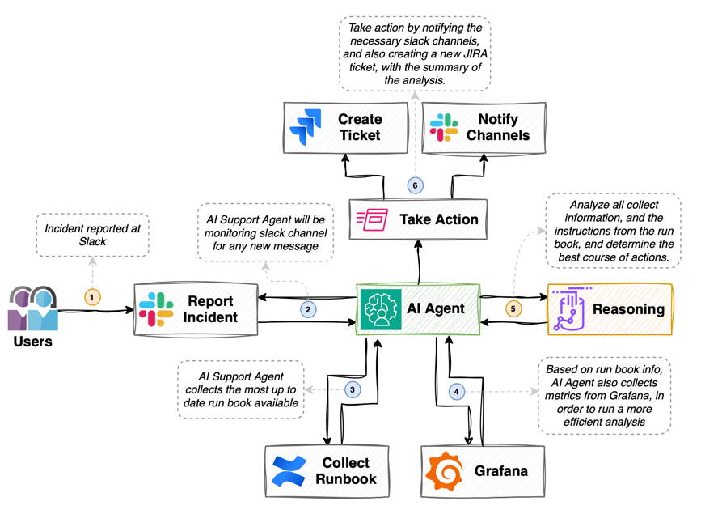
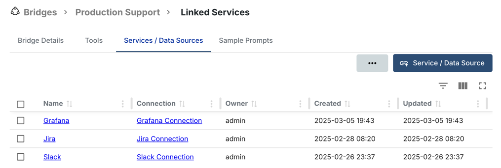
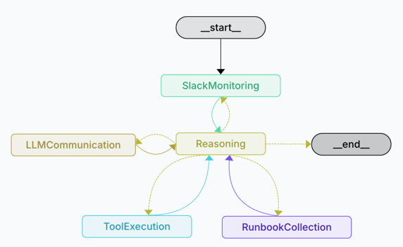

# Production Support example

This is an example project, that implements a fully functional Production Support AI Agent, using Lang Graph and Gentoro.

## Use case




## Example of a Runbook entry

Runbook: **Application Crashing on Login**

* **Step 1**: Collect additional information 

    Collect and analyze information at Grafana dashboard identified as "XYZ", and see if you detect any anomalies there.

* **Step 2**: Analyze the information collected

    Analyze the information collected and generate a summary and possible collection with the data collected at Grafana.

* **Step 3**: Notify the team

    Send the generated summary to the following slack channels: oncall-devops, oncall-dev, oncall-support.

* **Step 4**: Report the issue

    Create a JIRA issue, at the project XYZ, with the generated summary. Make sure you use a nice definition for the issue, and post the complete summary as the description of the issue.


## Configuring Gentoro

Based on the above example, you will need a new Bridge configured at Gentoro, with the following services:



With the following tools:


These tools are already available at Gentoro, and you can use them as is.

## Langgraph

The project will generate the following Graph:



Nodes:

- **SlackMonitoring**: Connects and monitors the slack channels, using Gentoro.
- **RunbookCollection**: Once a new incident is reported at Slack, collects the most up to date Runbook, using Gentoro.
- **Reasoning**: Node used to understand the current state of the interaction, and decide what to do next.
- **LLMCommunication**: Node responsible by the communication between the Agent and the underlining LLM.
- **ToolExecution**: Whenever the LLM requires one or more tools to be executed, delegates the execution to Gentoro's Runtime.


## Get started

Create a file called `.env` in the root of the project, and add the following variables:

```bash
OPENAI_API_KEY=...
LANGSMITH_API_KEY=...
GENTORO_API_KEY=...
GENTORO_BRIDGE_UID=...
JIRA_PROJECT_NAME=...
SLACK_CHANNEL_ID=...
```

Note that these might differ depending on your environment and target use case.

## Running

With all the above steps ready, you should be able to run this Agent.

To run, use the following command:

```bash
npm run dev
```

This will open a new browser window, and you will be able to see the Agent definition, within Lang Smith ecosystem.
